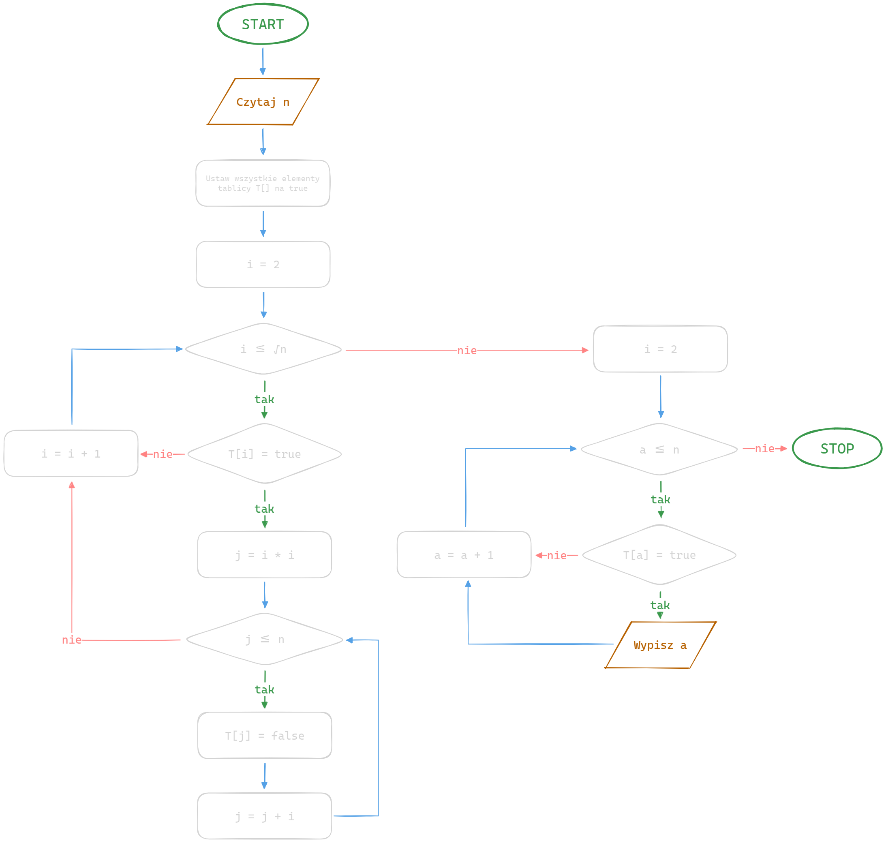
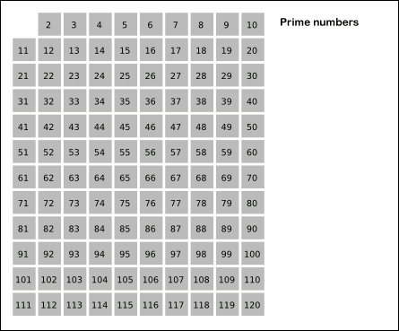

<style>
section.center h1, section.center h4, section.center p {
  text-align: center;
}
</style>

<!-- _class: center -->

# Algorytm Sito Eratostenesa<br>(Sieve of Eratosthenes)

Wojtek Zrałek

---

# Algorytm Sito Eratostenesa

> Służy on do znajdowania liczb pierwszych w danym przedziale `[2 ,n]`

> Został wymyślony przez greckiego matematyka Eratostenesa* z Cyreny, który żył w latach *276* - *194 p.n.e.\*

> Opiera się on na eliminacji liczby złożonych, czyli takich, które mają więcej niż dwa dzielniki, z przedziału `[2 ,n]` poprzez wykreślanie wielokrotności liczb pierwszych.

> Algorytm ten jest jednym z najstarszych wynalezionych algorytmów do znajdowania liczb pierwszych.

---

# Schemat blokowy



---

# Pseudokod

```python
n = input
T[n] = array<bool>

for s = 2, 3, 4, ..., n:
 T[s] = prawda

i = 2

while i * i <= n:
 if T[i] == True:
  j = i * i
  while j <= n:
   T[j] = False
   j = j + i
 i = i + 1

for a = 2, 3, 4, ..., n:
 if T[a] == True:
 print a
```

---

# Kod algorytmu w Javie

```java
import java.util.Arrays;
import java.util.Scanner;

public class Main {
    public static void main(String[] args) {
        Scanner scanner = new Scanner(System.in);
        System.out.print("Podaj liczbę n: ");
        int n = scanner.nextInt();

        boolean[] isPrime = new boolean[n + 1];
        Arrays.fill(isPrime, true);

        int i = 2;
        while (i * i <= n) {
            if (isPrime[i]) {
                int j = i * i;
                while (j <= n) {
                    isPrime[j] = false;
                    j = j + i;
                }
            }
            i = i + 1;
        }

        System.out.println("Liczby pierwsze od 2 do " + n + ":");
        for (int a = 2; a <= n; a++) {
            if (isPrime[a]) {
                System.out.print(a + " ");
            }
        }
    }
}
```

---

# Złożoność obliczeniowa

> Dla zakresu do n, algorytm Sita Eratostenesa ma złożoność obliczeniową **`O(n log log n)`**.
> Jest to złożoność _asymptotyczna_, ponieważ zależy ona od rozmiaru danych wejściowych.

> Algorytm jest szybszy od takiego sprawdzającego każdą liczbę z zakresu od 2 do n.

---

# Operacja dominująca w algorytmie

> W algorytmie Sita Eratostenesa operacją dominującą jest oznaczanie (czyli "wykreslanie" lub "odznaczanie") wielokrotności liczb pierwszych.

> Oznaczanie wielokrotności polega na ustawianiu flagi lub usuwaniu liczby z listy, co odpowiada operacji O(1) dla każdej zaznaczonej liczby.

---

# Zanimowanie działania algorytmu


_Dla tablicy n = 120_

---

<!-- _class: center -->

# Dzięki 💜

---

<!-- _class: center -->

# Źródła

#### [Wikipedia](https://en.wikipedia.org/wiki/Tower_of_Hanoi)

#### [zpe.gov.pl](https://zpe.gov.pl/pdf/P7MwVxKT0)

#### [ChatGPT](https://chat.openai.com/)
