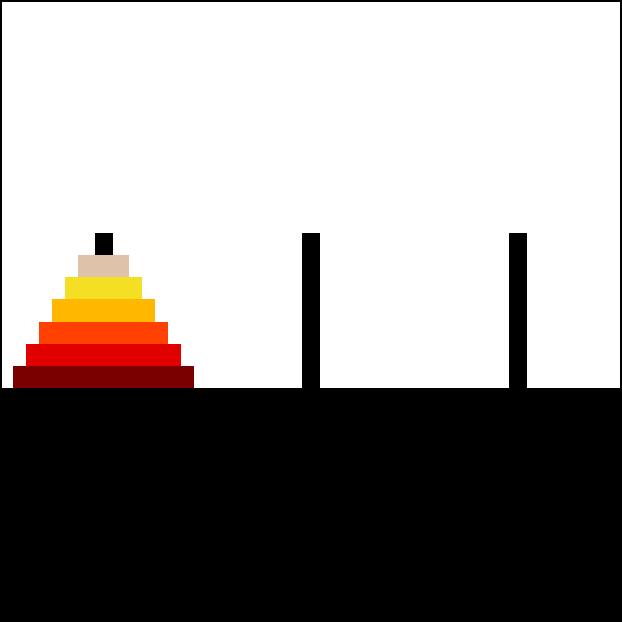

<!-- _class: center -->

# Problem Wież Hanoi 🗼 (Tower of Hanoi)

Wojtek Zrałek

---

# Wprowadzenie 🌟

> Wieża Hanoi to klasyczny problem matematyczny i logiczny, który został wymyślony przez Edouarda Lucasa w 1883 roku.

> Choć jego nazwa odnosi się do hinduskiego miasta Hanoi, nie ma bezpośredniego związku z tym miejscem.

> Problem jest bardziej abstrakcyjny i dotyczy przenoszenia dysków między trzema kijami czy palikami.

---

## Opis problemu 📝

### **_Warunki początkowe:_**

Trzy paliki (A, B, C) oraz stos krążków różnych rozmiarów, ułożonych od największego na dole do najmniejszego na górze, umieszczonych na jednym z prętów (najczęściej na pręcie A).

### **_Zasady ruchu:_**

W jednym ruchu można przenieść tylko jeden krążek, a krążek większy nie może leżeć na krążku mniejszym.

### **_Cel gry:_**

Przenieść stos krążków z jednego pręta na drugi, zgodnie z określonymi zasadami.

---

# Algorytm rozwiązania 💡

> ### **Algorytm rozwiązania problemu Wież Hanoi jest rekurencyjny (o tym później) i oparty na kilku krokach:**

1. **Przenieś `n-1` dysków z kija źródłowego na kij pomocniczy.**
2. **Przenieś największy dysk z kija źródłowego na kij docelowy.**
3. **Przenieś `n-1` dysków z kija pomocniczego na kij docelowy.**

---

# Rekurencja 🙀

> Jednym z fascynujących aspektów Wież Hanoi jest to, że może być rozwiązana przy użyciu rekurencji.
> Równanie rekurencyjne dla wieży Hanoi o n krążkach wygląda następująco:

## **`H(n)=2H(n−1)+1`**

> _gdzie **`H(n)`** to liczba ruchów potrzebnych do rozwiązania problemu z n krążkami._

---

# Złożoność czasowa ⏱️

> Złożoność czasowa algorytmu rozwiązującego problem Wieży Hanoi wynosi **`O(2^n)`**, co sprawia, że problem ten staje się trudny do rozwiązania dla większych wartości n.

---

# Zastosowania 📚

> ### **Problem Wież Hanoi nie tylko stanowi ciekawe wyzwanie matematyczne czy zwykłą grę logiczną, ale ma także praktyczne zastosowania.**

 

> ### **Algorytmy wywodzące się z tego problemu są używane w informatyce, np. w strategiach sortowania czy przy rozwiązywaniu problemów logicznych.**

---

<!-- _class: center -->

# Źródła 🔗

#### [Wikipedia](https://en.wikipedia.org/wiki/Tower_of_Hanoi)

#### [ChatGPT](https://chat.openai.com/)

---

<!-- _class: center -->

# Dzięki 💜
